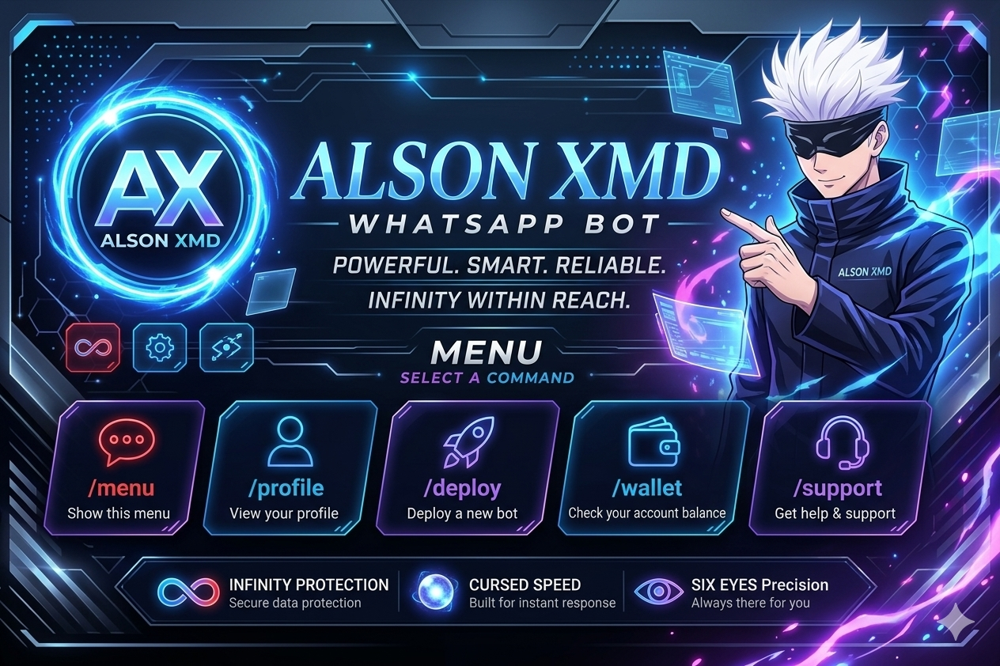

⚡ ALSON XMD

🚀 Powerful • Stylish • Easy to Deploy

A WhatsApp bot built for the Alson community.

  
  
  

---

🟢 WhatsApp Channel

📢 JOIN THE OFFICIAL ALSON XMD CHANNEL

Get updates, fixes, announcements and new bot features.

---

✨ About Alson XMD

Alson XMD is a WhatsApp automation bot designed to provide useful commands, group tools, entertainment features and AI-powered functionality.

It is designed to be simple enough to deploy from an Android phone using Termux.

«⚠️ Use the bot responsibly and follow WhatsApp's Terms of Service. Avoid spam, bulk messaging and abusive automation.»

---

📱 Requirements

Before starting, make sure you have:

- 📱 Android phone
- 🟢 Termux
- 🌐 Internet connection
- 🟢 WhatsApp account
- 📦 Git
- 🟢 Node.js
- 🔑 Your bot pairing/login method
- 💾 Enough storage

---

🚀 INSTALLATION — TERMUX

1️⃣ Update Termux

Open Termux and run:

pkg update && pkg upgrade -y

---

2️⃣ Install Required Packages

Run:

pkg install git nodejs ffmpeg imagemagick python make clang -y

---

3️⃣ Check Node.js

Run:

node -v

You should see a Node.js version.

Then check npm:

npm -v

---

📥 4️⃣ Clone ALSON XMD

Clone the repository:

git clone https://github.com/alsonmachingauta06-lab/Alson-Bot.git

Enter the bot directory:

cd Alson-Bot

---

📦 5️⃣ Install Dependencies

Run:

npm install

If the project uses a lock file, you can also use:

npm install --legacy-peer-deps

---

🖼️ 6️⃣ Bot Image

The bot image is located inside:

assets/bot_image.jpg

Your project should look similar to:

Alson-Bot/
│
├── assets/
│   └── bot_image.jpg
│
├── commands/
├── lib/
├── index.js
├── package.json
└── README.md

---

🔐 7️⃣ CONFIGURATION

Before starting the bot, check the configuration files included in the repository.

If the project uses environment variables, create your ".env" file:

nano .env

Example:

OWNER_NUMBER=263XXXXXXXXX
OWNER_NAME=Alson Machingauta
BOT_NAME=Alson XMD

Save:

CTRL + X
Y
ENTER

«🔒 IMPORTANT: Never upload private API keys, session files, passwords or authentication credentials to GitHub.»

---

🔗 8️⃣ CONNECT ALSON XMD TO WHATSAPP

Start the bot:

node index.js

If the bot provides a pairing-code option, follow the instructions displayed in Termux.

Enter the pairing code in:

WhatsApp → Linked Devices → Link a Device → Link with phone number

After successful authentication, the bot should connect.

---

▶️ 9️⃣ START THE BOT

Normal start:

node index.js

If your project contains a start script:

npm start

---

♻️ KEEP THE BOT RUNNING

For a simple Termux deployment, you can use:

node index.js

To keep Termux from sleeping:

termux-wake-lock

You can stop the bot with:

CTRL + C

---

🤖 MINI BOT DEPLOYMENT

Want to create a small WhatsApp bot instead of using the complete Alson XMD project?

The basic deployment flow is:

ANDROID
   │
   ▼
TERMUX
   │
   ├── Node.js
   ├── Git
   └── Bot source
   │
   ▼
npm install
   │
   ▼
node index.js
   │
   ▼
PAIR / LOGIN
   │
   ▼
WHATSAPP
   │
   ▼
🤖 MINI BOT ONLINE

---

🧩 MINI BOT — QUICK SETUP

Create a project:

mkdir mini-bot
cd mini-bot

Initialize Node.js:

npm init -y

Install the WhatsApp library used by the project:

npm install @whiskeysockets/baileys

Create the main file:

nano index.js

Paste your mini-bot code into "index.js".

Save with:

CTRL + X
Y
ENTER

Then start it:

node index.js

---

🌐 DASHBOARD-STYLE DEPLOYMENT

If you want a deployment experience similar to a bot dashboard such as Jawaad-style dashboards, the general process is:

┌─────────────────────────────┐
│       🤖 MINI BOT           │
├─────────────────────────────┤
│                             │
│  1. Create bot              │
│  2. Enter bot name          │
│  3. Install dependencies    │
│  4. Start bot               │
│  5. Pair WhatsApp           │
│  6. Bot goes ONLINE         │
│                             │
└─────────────────────────────┘

For a real dashboard, you need:

- 🌐 Web dashboard
- 🖥️ Backend/server
- 🔐 Authentication
- 📦 Bot deployment system
- 📊 Bot status monitoring
- 🔑 Secure session management
- 🟢 Start/Stop controls
- 📱 Pairing-code interface

Do not put WhatsApp session credentials directly into a public GitHub repository.

---

🛠️ USEFUL COMMANDS

Update packages

pkg update && pkg upgrade -y

Enter bot directory

cd ~/Alson-Bot

Install dependencies

npm install

Start bot

node index.js

Start with npm

npm start

Stop bot

CTRL + C

Check Node

node -v

Check npm

npm -v

Check Git

git --version

---

🐞 TROUBLESHOOTING

❌ "npm install" fails

Try:

npm install --legacy-peer-deps

---

❌ "node: command not found"

Install Node.js:

pkg install nodejs -y

Then:

node -v

---

❌ "git: command not found"

Install Git:

pkg install git -y

---

❌ Bot does not start

Make sure you are inside the bot directory:

cd ~/Alson-Bot

Then:

npm install

And:

node index.js

---

❌ Pairing does not work

Make sure:

- 📱 WhatsApp is installed
- 🌐 Internet is working
- 🔢 The number is entered correctly
- 🔗 WhatsApp Linked Devices is available
- ⏱️ You enter the pairing code before it expires
- 📦 Dependencies are installed

If the problem continues, restart the bot:

CTRL + C
node index.js

---

🔒 SECURITY

NEVER upload these to GitHub:

.env
session/
auth_info/
creds.json
API KEYS
PASSWORDS
PRIVATE TOKENS

Add sensitive files to ".gitignore".

Example:

.env
session/
auth_info/
creds.json
node_modules/

---

⭐ SUPPORT ALSON XMD

If you like the project:

⭐ Star the repository

🍴 Fork the repository

📢 Join the WhatsApp Channel

🐞 Report bugs

💡 Suggest improvements

---

📢 OFFICIAL WHATSAPP CHANNEL

🔥 ALSON XMD COMMUNITY

Updates • Features • Fixes • Announcements

---

👑 CREDITS

🤖 Alson XMD

Developer: Alson Machingauta

Bot: Alson XMD

Repository: Alson-Bot

Community: Alson XMD WhatsApp Channel

---

❤️ SPECIAL THANKS

Thanks to the open-source community and developers who make WhatsApp automation projects possible.

This project may use open-source libraries. Please respect their respective licenses and attribution requirements.

---

⚠️ DISCLAIMER

Alson XMD is provided for educational and automation purposes.

The developer is not responsible for:

- Account bans
- Misuse of the bot
- Spam
- Unauthorized automation
- Loss of WhatsApp accounts
- Third-party service issues

Use responsibly.

---

⚡ ALSON XMD ⚡

🤖 Your WhatsApp. Your Automation.

Made with ❤️ by Alson Machingauta

📢 Join the official WhatsApp Channel

  

© 2026 Alson XMD — All Rights Reserved

